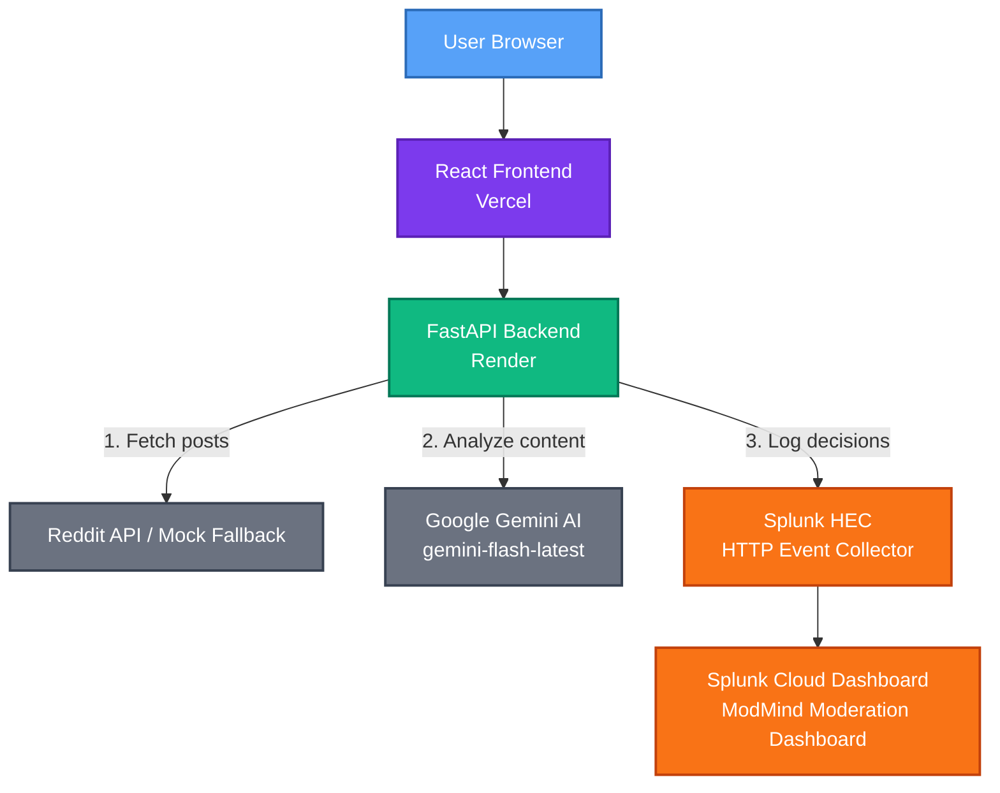

# ModMind — Splunk Integration Architecture

## Data Flow



```text
User Browser
↓
React Frontend (Vercel)
↓
FastAPI Backend (Render)
↓ (1) Fetch posts
Reddit API / Mock Fallback
↓ (2) Analyze content
Google Gemini AI (gemini-flash-latest)
↓ (3) Log decisions
Splunk HEC (HTTP Event Collector)
↓
Splunk Cloud Dashboard
(ModMind Moderation Dashboard)
```

## Components

### Frontend
- React + Tailwind CSS
- Deployed on Vercel
- URL: https://modmind-splunk.vercel.app

### Backend
- FastAPI + Python
- Deployed on Render
- URL: https://modmind-splunk-backend.onrender.com

### AI Engine
- Google Gemini via google-genai SDK
- Model: gemini-flash-latest
- Returns: sentiment, toxicity score, action, confidence

### Splunk Integration
- HTTP Event Collector (HEC)
- Sourcetype: modmind_reddit
- Index: main
- Events contain: post_id, subreddit, title, 
  toxicity_score, sentiment, action, timestamp

### Splunk Dashboard
- Total Moderation Decisions (Single Value)
- Moderation Actions Breakdown (Bar Chart)
- Sentiment Distribution (Pie Chart)
- Toxicity Score Over Time (Line Chart)

## Track
Security — AI-powered threat detection and 
content moderation for Reddit communities
